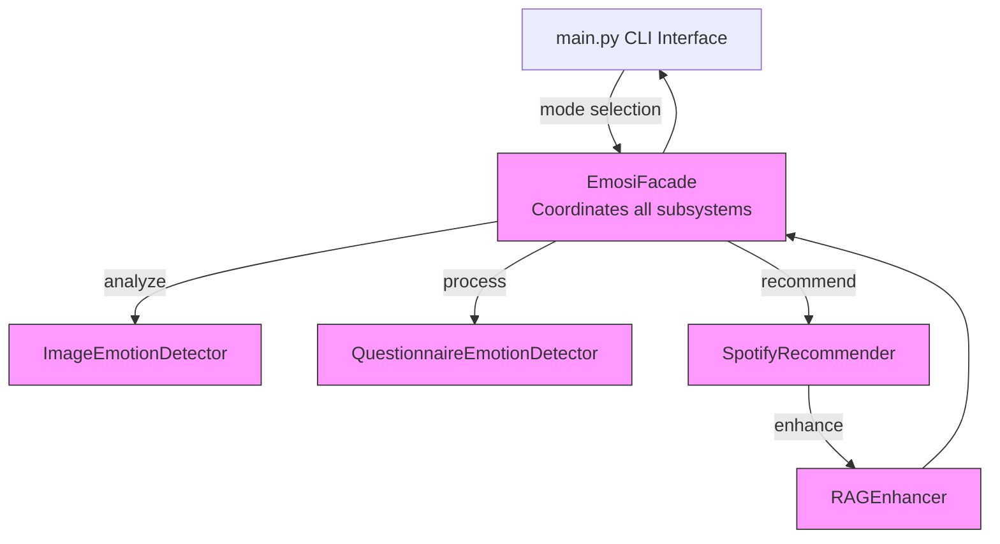

# EMOSI: Emotion-based Music Selection Interface

EMOSI is a system that recommends music based on emotions detected from:
1. Images
2. Text queries
3. Questionnaire responses

## Features

- **Image-based emotion detection**: Using Qwen2.5-Omni-7B to analyze emotions in images
- **Text-based music recommendation**: Recommend music based on text queries
- **Questionnaire-based emotion detection**: Determine emotions based on user responses
- **Combined recommendation**: Compare and integrate recommendations from multiple sources
- **RAG enhancement**: Contextual explanations for why specific tracks were recommended
- **FAISS search**: Fast and efficient similarity search for recommendations
- **Year-based filtering**: Prioritize newer songs in recommendations

## Installation

```bash
# Clone the repository
git clone https://github.com/yourusername/emosi.git
cd emosi

# Install the package
pip install -e .
```

## Usage

### Command Line Interface

```bash
# Text-based recommendation
python main.py --mode=text --text="Happy energetic dance music" --year-cutoff=2015

# Image-based recommendation
python main.py --mode=image --image=path/to/image.jpg

# Questionnaire-based recommendation
python main.py --mode=questionnaire

# Combined recommendation (both image and questionnaire)
python main.py --mode=combined --image=path/to/image.jpg

# For more options
python main.py --help
```

### As a Python Package

```python
from emosi.facade import EmosiFacade
from emosi.utils import format_recommendation_output

# Initialize the system
emosi = EmosiFacade(use_dummy=True)  # use_dummy=True for testing without a model

# Text-based recommendation
recommendations = emosi.recommend_by_text("Relaxing piano music", 
                                         num_recommendations=5, 
                                         year_cutoff=2010)
print(format_recommendation_output(recommendations))

# Image-based recommendation
emotion, scores, recommendations = emosi.run_image_based_recommendation("path/to/image.jpg")
print(f"Detected emotion: {emotion}")
print(format_recommendation_output(recommendations))

# Questionnaire-based recommendation
questionnaire = emosi.get_questionnaire()
# Display questions and collect responses
responses = ["Happy and cheerful", "High energy", "Celebrating a happy moment"]
emotion, scores, recommendations = emosi.run_text_based_recommendation(responses=responses)
print(f"Detected emotion: {emotion}")
print(format_recommendation_output(recommendations))

# Combined recommendation
context, image_recs, question_recs = emosi.run_combined_recommendation(
    image_path="path/to/image.jpg",
    responses=responses
)
print(f"Image emotion: {context['image_emotion']}")
print(f"Questionnaire emotion: {context['questionnaire_emotion']}")
print(f"Similarity: {context['emotion_similarity']:.2f}")
```

## System Architecture

EMOSI uses a facade design pattern to integrate multiple components. The full architecture diagram can be found in the `docs/` directory.



For the full detailed architecture diagram, see [EMOSI Architecture](docs/emosi-architecture.mmd).

## Project Structure
```
emosi/
├── __init__.py              # Package initialization
├── constants.py             # Emotion categories and other constants
├── image_detector.py        # Image emotion detection
├── questionnaire_detector.py # Questionnaire-based emotion detection
├── data_loader.py           # Loading and processing Spotify data
├── recommender.py           # FAISS-based music recommendation
├── rag_enhancer.py          # RAG enhancement for recommendations
├── facade.py                # Facade class for the EMOSI system
├── utils.py                 # Utility functions
└── main.py                  # Command-line interface
```

## Requirements

- Python 3.7+
- Qwen2.5-Omni-7B model (or similar)
- FAISS for similarity search
- Pandas, NumPy, Torch, and other dependencies

## License

MIT License
