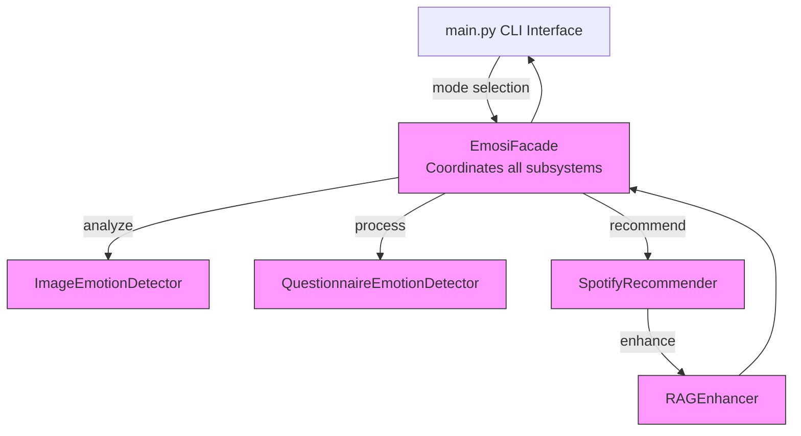

# EMOSI: Emotion-based Music Selection Interface

EMOSI is a system that recommends music based on emotions detected from:
1. Images
2. Text queries
3. Questionnaire responses

## Features

- **Image-based emotion detection**: Using Qwen2.5-Omni-7B to analyze emotions in images
- **Text-based music recommendation**: Recommend music based on text queries
- **Questionnaire-based emotion detection**: Determine emotions based on user responses
- **Combined recommendation**: Compare and integrate recommendations from multiple sources
- **RAG enhancement**: Contextual explanations for why specific tracks were recommended
- **FAISS search**: Fast and efficient similarity search for recommendations
- **Year-based filtering**: Prioritize newer songs in recommendations

## Installation

```bash
# Clone the repository
git clone https://github.com/yourusername/emosi.git
cd emosi

# Install dependencies
pip install -r requirements.txt

# Special requirements for Qwen model
pip uninstall transformers
pip install git+https://github.com/BakerBunker/transformers@21dbefaa54e5bf180464696aa70af0bfc7a61d53
pip install accelerate
pip install qwen-omni-utils[decord] -U
pip install huggingface_hub[hf_xet]
```

## Usage

### Command Line Interface

```bash
python3 main.py --mode=batch --input-folder=/your/folder/inputs --csv-file=/your/folder/emosi_survey_responses_apr23.csv --output-dir=./emosi_output --num-recommendations=10 --year-cutoff=2015
```

## System Architecture

EMOSI uses a facade design pattern to integrate multiple components. The full architecture diagram can be found in the `docs/` directory.



For the full detailed architecture diagram, see [EMOSI Architecture](docs/emosi-architecture.mmd).

## Project Structure
```
emosi/
├── __init__.py              # Package initialization
├── constants.py             # Emotion categories and other constants
├── image_detector.py        # Image emotion detection
├── questionnaire_detector.py # Questionnaire-based emotion detection
├── data_loader.py           # Loading and processing Spotify data
├── recommender.py           # FAISS-based music recommendation
├── rag_enhancer.py          # RAG enhancement for recommendations
├── facade.py                # Facade class for the EMOSI system
├── utils.py                 # Utility functions
└── main.py                  # Command-line interface
```

## Requirements

- Python 3.7+
- Qwen2.5-Omni-7B model (or similar)
- FAISS for similarity search
- Pandas, NumPy, Torch, and other dependencies

## License

MIT License

